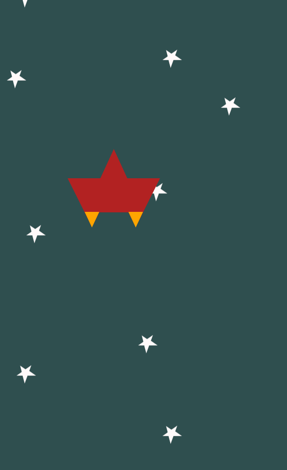

# NSS-The-Static-Web-Challenge7
##Synopsis
The challenge was to replicate the shapes and the animations that are in the animated GIF below. You could only use CSS. No JavaScript and no images.
</a>
##Motivation
While attending the Nashville Software School, this was a challenge that we could complete to practice CSS.
